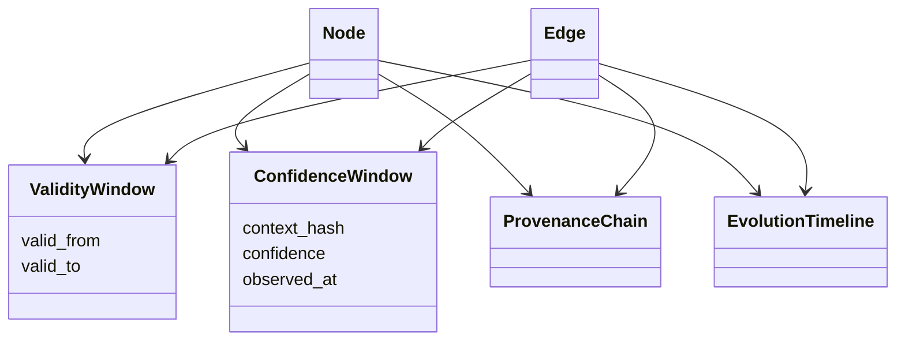

# Temporal Graph Model

## Purpose

The temporal graph model ensures every structural fact has time semantics, confidence evolution, provenance chains, and invalidation behavior.

## Architecture

## Lifecycle

Facts enter as semantic objects or graph deltas. The evolution layer assigns validity windows, records confidence samples, and later closes validity when drift, semantic diffs, rollback, or branch merge resolution invalidates the fact.

## Implemented Contract

`src/synapse/temporal/graph.py` reconstructs temporal facts at a context head by walking context ancestry and applying semantic validity windows. It returns a historical `TemporalGraphState` without treating the current projection as historical truth.

## Responsibilities

- Track `valid_from` and `valid_to`.
- Track confidence over time.
- Preserve provenance chains.
- Record evidence count.
- Support invalidation rules.
- Reconstruct graph state at historical contexts.

## Data Flow

Context commits produce graph projections. Temporal facts wrap graph rows with validity intervals, confidence windows, and provenance links.

## Failure Modes

- Current graph projection is served for historical queries.
- Confidence changes are overwritten rather than sampled.
- Invalidation mutates history instead of closing validity windows.

## Edge Cases

- A rollback reactivates a prior fact.
- A branch has a fact active while main invalidates it.
- A fact's summary remains the same but confidence decays.

## Scalability Notes

Use context hash and stable ID indexes for temporal graph queries.

## Security Notes

Historical graph facts remain sensitive after invalidation.

## Performance Considerations

Keep hot temporal metadata in SQLite and rich evidence in content-addressed objects.

## Future Extensibility

Map temporal validity and confidence windows to Neo4j relationships when the graph projection backend evolves.
