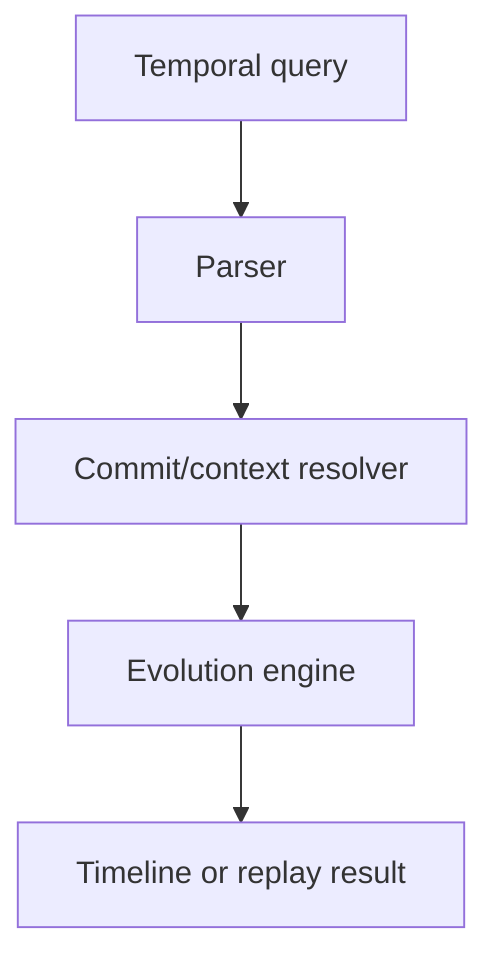

# Temporal Query Language

## Purpose

A future temporal query language should let users ask how understanding changed over Git and context time.

## Example Queries

```text
SHOW cognition BEFORE commit abc123
SHOW auth evolution BETWEEN 2026-01-01 AND 2026-05-01
SHOW assumptions invalidated AFTER Redis removal
SHOW confidence decay FOR payment architecture
SHOW branch divergence BETWEEN main AND payments-rewrite
```

## Architecture



## Lifecycle

The first implementation exposes CLI/API methods directly. A language should come later, after the engine contracts stabilize.

## Implemented Contract

`src/synapse/query/` provides typed temporal query methods before introducing a standalone query language. Current capabilities include cognition before a Git commit, context evolution between dates, assumptions invalidated by a context, and confidence decay for a stable cognition ID.

## Responsibilities

- Resolve Git commits, branches, dates, and context hashes.
- Query timelines, semantic diffs, confidence evolution, assumptions, and replay states.
- Keep results bounded and provenance-aware.

## Failure Modes

- Query language grows before core temporal semantics are stable.
- Date-based queries ignore Git lineage.
- Results omit confidence or provenance.

## Edge Cases

- Rebased commits.
- Multiple contexts for one Git commit.
- Branch names reused after deletion.

## Scalability Notes

Compile queries to indexed context/event scans.

## Security Notes

Apply permission checks after query planning and before result materialization.

## Performance Considerations

Use context hash resolution and pagination for long timelines.

## Future Extensibility

Expose the same query model through CLI, REST, MCP, and temporal visualization.
