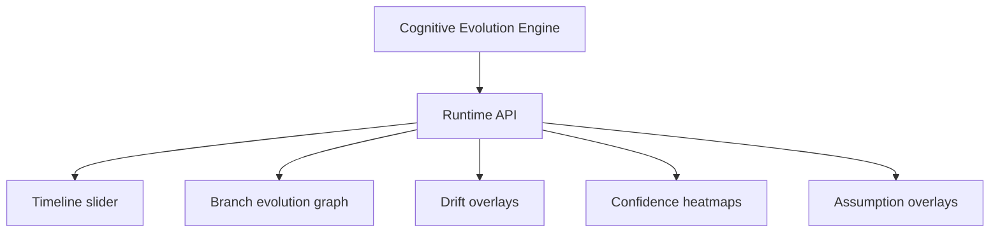

# Temporal Visualization

## Purpose

Temporal visualization turns context evolution into an inspectable living architecture view: timelines, branch graphs, drift overlays, confidence heatmaps, and assumption invalidation overlays.

## Architecture

## Lifecycle

Visualization should remain read-only first. It consumes evolution APIs and only later gains guarded controls for rollback, epoch creation, or assumption review.

## Responsibilities

- Show architecture through time.
- Highlight confidence decay.
- Show branch divergence.
- Surface stale assumptions and drift zones.
- Animate dependency and domain evolution.

## Data Flow

Timeline events, semantic diffs, assumptions, and replay states flow from the runtime to the TUI or future UI.

## Failure Modes

- Visualization becomes decorative and hides provenance.
- UI shows current facts on historical contexts.
- Long timelines overload the client.

## Edge Cases

- Multiple branches share context ancestors.
- Epoch labels overlap.
- Manual notes create context states without code changes.

## Scalability Notes

Virtualize long timelines and request bounded windows from the runtime.

## Security Notes

Visualization surfaces must obey the same redaction and permission policies as MCP/API.

## Performance Considerations

Precompute lightweight timeline summaries and fetch evidence on demand.

## Future Extensibility

Add a timeline slider, replay animation, branch cognition graph, and confidence heatmap in the Textual dashboard.

