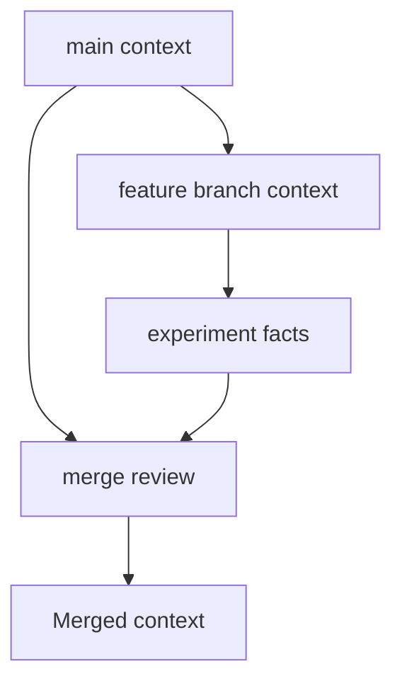

# Branch Context

## Purpose

Branch context lets Synapse model different project realities on different Git branches without forcing contradictory facts into one state.

## Architecture

## Lifecycle

A new branch inherits the parent context head. As branch-specific events are processed, context diverges. Merge creates a multi-parent context after conflict analysis.

## Responsibilities

- Track active context head per branch.
- Preserve branch-specific facts and assumptions.
- Prevent accidental leakage across branches.
- Detect causal merge conflicts.
- Support branch-aware queries.

## Data Flow

Git branch events update branch metadata; context versions carry branch identity and parent lineage.

## Failure Modes

- Branch checkout serves mainline context.
- Experimental facts become global.
- Merge conflict is auto-resolved silently.
- Deleted branch leaves orphaned active state.

## Edge Cases

- Detached HEAD.
- Branch renamed.
- Long-lived branch diverges far from main.
- Cherry-pick copies a change without copying all context.

## Scalability Notes

Store branch heads as references, not duplicated full state. Share unchanged objects between branches.

## Security Notes

Branch names and facts can be sensitive. Access controls should handle branch-scoped context.

## Performance Considerations

Branch switches should activate existing projections quickly and enqueue expensive reconciliation in the background.

## Future Extensibility

Add branch context visualization in the Textual dashboard.
