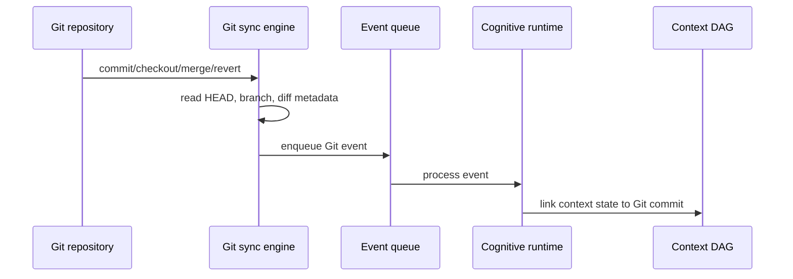

# Git Sync

## Purpose

Git sync anchors cognition to repository history. Synapse watches Git state changes and links context versions to commits, branches, checkouts, reverts, and merges.

## Architecture

## Lifecycle

Sync initializes from current repository state, records the initial Git commit if present, then observes state transitions through hooks, polling fallback, and daemon checks.

## Responsibilities

- Detect HEAD, branch, merge, rebase, checkout, and revert signals.
- Link context objects to Git commits.
- Map Git lineage to context DAG lineage.
- Avoid doing heavy work in hooks.
- Reconcile missed events on daemon restart.

## Data Flow

Git metadata enters as lightweight events. The runtime performs semantic work asynchronously after the Git event is durable.

## Failure Modes

- Hook not installed or disabled.
- Rebase rewrites commit hashes.
- Detached HEAD loses branch metadata.
- GitPython cannot read repository due to lock.

## Edge Cases

- Initial project is not a Git repo.
- Empty repository has no commits.
- Worktree checkout.
- Submodules and nested repositories.

## Scalability Notes

Avoid walking full Git history during hot operations. Use incremental commit ranges and lazy history enrichment.

## Security Notes

Git metadata is local but may expose branch names and file paths. Agent access should be scoped.

## Performance Considerations

The hook path should emit a small event and exit quickly. Diff parsing belongs to background workers.

## Future Extensibility

Support optional signed Git commit verification as a trust signal.

