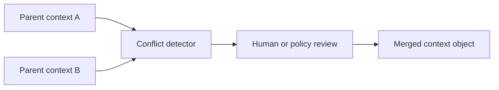

# Merge Conflicts

## Purpose

Causal merge conflicts occur when branch facts, assumptions, or architecture decisions cannot be safely combined.

## Architecture

## Lifecycle

During Git merge detection, Synapse compares context deltas and active facts. Non-conflicting facts merge automatically with provenance. Conflicts require explicit resolution.

## Responsibilities

- Identify contradictory active facts.
- Preserve both sides' evidence.
- Require review for high-impact conflicts.
- Emit merged facts with confidence rationale.
- Record conflict resolution provenance.

## Data Flow

Parent context heads feed the merge engine, which emits conflict records and a final merged context object after policy or human resolution.

## Failure Modes

- Silent merge creates false confidence.
- Conflict detector compares only text, not meaning.
- Resolution loses one branch's provenance.
- Semantic retrieval returns pre-merge contradiction as current truth.

## Edge Cases

- Both branches change the same fact in compatible ways.
- One branch deletes a module while another renames it.
- Documentation conflict without code conflict.
- Low-confidence facts conflict with high-confidence facts.

## Scalability Notes

Compare affected subgraphs rather than whole memory where possible. Use provenance links to narrow candidates.

## Security Notes

Only authorized users or policies can resolve conflicts that affect durable context state.

## Performance Considerations

Merge analysis can be asynchronous after Git merge detection, but agents must be told when context is pending reconciliation.

## Future Extensibility

Add conflict-resolution UX in TUI and optional structured resolution files.
