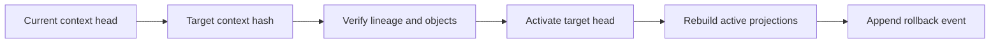

# Rollback Semantics

## Purpose

Rollback semantics define how Synapse restores an earlier cognitive state without deleting history.

## Architecture

## Lifecycle

Rollback validates the target context, appends a rollback event, changes the active head, and rebuilds graph/vector projections for that head.

## Responsibilities

- Never delete context history.
- Validate target existence and permissions.
- Restore graph and vector active views.
- Explain what facts became active or inactive.
- Support Git checkout and manual rollback commands.

## Data Flow

Rollback reads context objects and events, activates a prior DAG node, and emits projection invalidation/update jobs.

## Failure Modes

- Rollback mutates historical objects.
- Vector index still returns facts from abandoned head.
- Target context references missing objects.
- Rollback races with active indexing.

## Edge Cases

- Git checkout has no matching context object.
- User rolls back cognition but not Git.
- Revert commit semantically undoes prior work but remains a new Git commit.
- Branch rollback crosses merge boundary.

## Scalability Notes

Use snapshots near common rollback points but verify against event and object hashes.

## Security Notes

Rollback is a write operation and must require permission through MCP/API. Audit rollback requests.

## Performance Considerations

Projection rebuild can be staged: immediately switch active head, then refresh expensive vector indexes with clear stale-state markers.

## Future Extensibility

Add dry-run rollback diffs and policy-based approval for team cognition.

