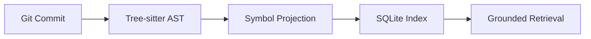
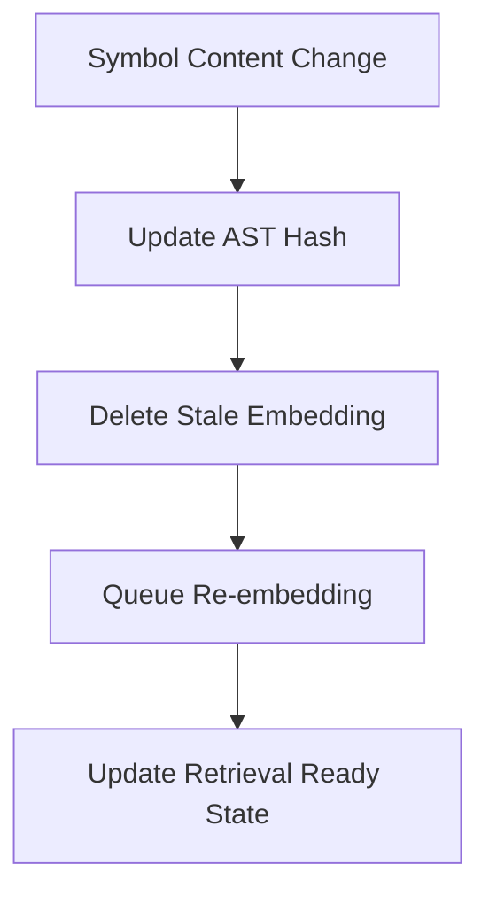

# Deterministic Indexing

Synapse ensures that your code context is always accurate and up-to-date through a robust incremental indexing pipeline.

## Ingestion Flow

1.  **Git State Resolution:** Resolve current branch and `HEAD` commit.
2.  **File Scanning:** Efficiently walk the repository (respecting `.gitignore`).
3.  **Change Detection:** Compare the current file content hash against the SQLite index.
4.  **Tree-sitter Parsing:** (Changed files only) Extract symbols and relationships.
5.  **Graph Update:** Surigically update the symbols and edges for the modified files.
6.  **Embedding Invalidation:** (Optional) Purge stale embeddings for changed symbols.

## Rebuild Guarantees

Because the index is a deterministic projection of the Git state, you can always safely delete the `.synapse` directory and run `synapse init` to perfectly reconstruct the state. This "wipe-and-rebuild" property is critical for maintaining developer trust.

## Incremental Performance

Synapse is designed for large codebases. By using content hashes and surgical updates, a change to a single file in a monorepo typically results in less than 1 second of indexing overhead.

## Supported Parsers

| Language | Parser | Symbols Extracted |
| :--- | :--- | :--- |
| **Python** | `tree-sitter-python` | Classes, functions, methods, imports |
| **JavaScript** | `tree-sitter-javascript` | Declarations, arrow functions, exports |
| **TypeScript** | `tree-sitter-typescript` | Interfaces, types, namespaces, decorators |

---

## Git Snapshot Grounding

Synapse treats every Git commit as an immutable snapshot. This ensures that context remains consistent even as the repository evolves.

## Embedding Invalidation Flow

To prevent semantic drift, Synapse automatically invalidates embeddings when the underlying code changes.

