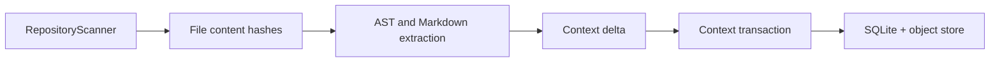

# Ingestion

Ingestion turns repository files into durable structural context.

## Flow

## Rules

- `.git`, `.synapse`, virtualenvs, build outputs, dependency folders, caches, and generated directories are excluded.
- Files above `max_file_bytes` are skipped.
- Content hashes drive incremental change detection.
- Rename detection matches deleted and added files with identical content hashes.
- Unsupported languages are stored as file nodes but not parsed into symbols.
- Parser failures become semantic metadata and do not fail ingestion.

## Structural Scope

The structural index tracks packages, modules, Markdown documents, classes, functions, and imports. It intentionally avoids variables, expressions, tokens, call graphs, incident objects, and speculative architecture entities.

## Invalidation

When a file changes or is deleted, Synapse emits invalidation records for the file node, parsed symbols, semantic summaries, connected edges, and overlays targeting those objects. Previous context commits remain immutable.
