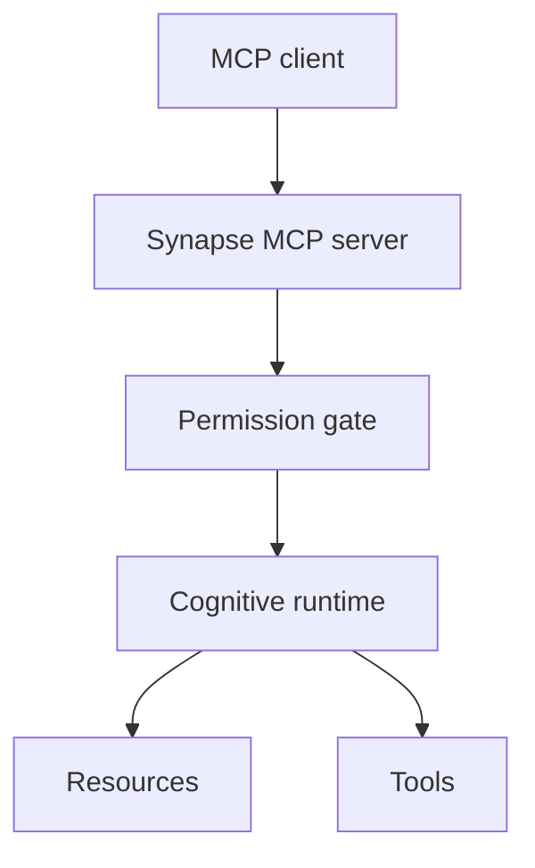

# MCP Interface

## Purpose

The MCP interface exposes Synapse cognition to AI agents through standard resources and tools. MCP is the protocol boundary, not the reasoning layer.

## Architecture

## Lifecycle

The MCP server starts with or connects to the runtime daemon, advertises resources and tools, validates permissions per request, and returns bounded context with provenance.

## Responsibilities

- Expose current context, diffs, drift, graph, and search.
- Gate mutating operations.
- Keep tool descriptions precise and injection-resistant.
- Avoid storing agent prompts as durable cognition by default.
- Return confidence and provenance.

## Data Flow

MCP requests become runtime queries or command events. Runtime responses are scoped, redacted, and labeled with trust metadata.

## Failure Modes

- MCP tool writes bypass runtime policy.
- Tool description becomes a prompt-injection channel.
- Agent treats low-confidence memory as truth.
- MCP server becomes coupled to one model provider.

## Edge Cases

- Multiple agents query simultaneously.
- Agent requests context for inactive branch.
- Runtime is replaying or indexing.
- Permission state changes during request.

## Scalability Notes

MCP should serve compact resources and require pagination or scoped queries for large context.

## Security Notes

Default to read-only. Mutations require explicit permission and audit events.

## Performance Considerations

Use cached summaries for common read resources but include state hashes so clients know freshness.

## Future Extensibility

Add prompt templates only after tool/resource contracts are stable.

