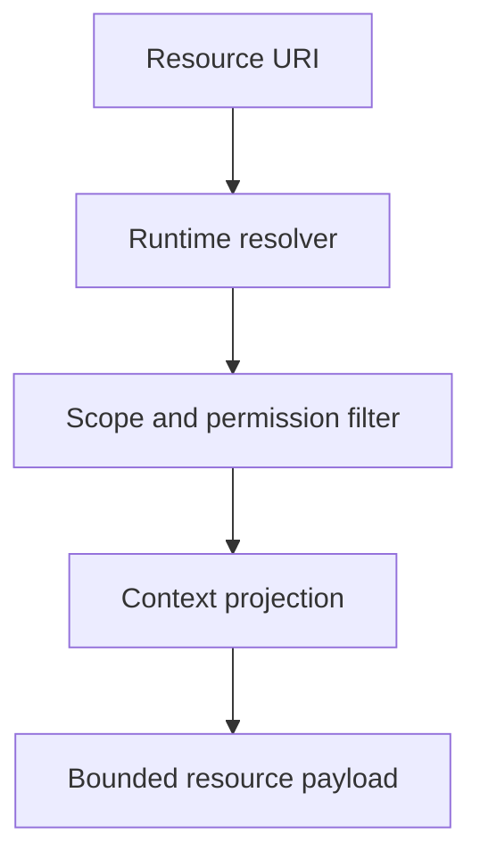

# MCP Resources

## Purpose

MCP resources expose read-only snapshots of Synapse cognition to agents in a predictable, bounded shape.

## Architecture

## Lifecycle

Resources are resolved on request against a specific context head, branch, or Git commit and include freshness metadata.

## Responsibilities

- `synapse://context/current`
- `synapse://context/{hash}`
- `synapse://drift/current`
- `synapse://graph/summary`
- `synapse://decisions/current`
- `synapse://risks/current`

## Data Flow

Resource requests read current projections and evidence references. They do not mutate runtime state.

## Failure Modes

- Resource omits state hash and appears fresher than it is.
- Resource exposes restricted branch facts.
- Large resource payload overwhelms agent context.
- Historical resource incorrectly uses current facts.

## Edge Cases

- Requested context is archived.
- Runtime is in low-power mode.
- Branch no longer exists but context history does.
- Resource is requested during rollback.

## Scalability Notes

Resources should be summary-oriented with links to more specific tools.

## Security Notes

Apply permission filtering before serialization. Redaction must happen inside the runtime, not in client prompts.

## Performance Considerations

Cache common resources by context head and permission scope.

## Future Extensibility

Add subscription-style resources through WebSocket-backed notifications when MCP clients support it.

