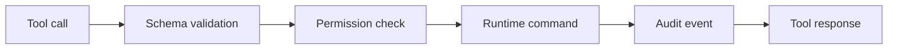

# MCP Tools

## Purpose

MCP tools provide controlled actions agents can request from Synapse. Tools are thin adapters over runtime commands.

## Architecture

## Lifecycle

Tools are registered at server startup, validated by schema, checked against permissions, executed through runtime services, and audited.

## Responsibilities

- `get_context`: read current bounded context.
- `search_cognition`: semantic cognition search with filters.
- `search_memory`: compatibility alias for older clients.
- `compare_contexts`: diff two context hashes.
- `impact_context`: explain semantic architectural impact between context hashes.
- `verify_lineage`: run read-only cognition lineage checks.
- `show_drift`: list stale or contradicted facts.
- `add_note`: add human-approved manual context.
- `rollback_context`: permission-gated activation of prior context.

## Data Flow

Tool parameters become typed command objects. Mutating tools enqueue events; read tools query current projections.

## Failure Modes

- Tool returns too much unfiltered context.
- Mutating tool lacks audit record.
- Tool input contains prompt-injection instructions.
- Rollback is exposed as read-only.

## Edge Cases

- Context hash not found.
- Query spans multiple branches.
- Runtime currently rebuilding projections.
- User lacks write permission.

## Scalability Notes

Use pagination, limits, and branch filters. Tools must not stream the whole memory graph by default.

## Security Notes

Tool descriptions should avoid telling agents how to bypass policies. Treat arguments as untrusted data.

## Performance Considerations

Return summaries first and expose drill-down tools for evidence.

## Future Extensibility

Add specialized tools for impact analysis and documentation maintenance after core tools are stable.
