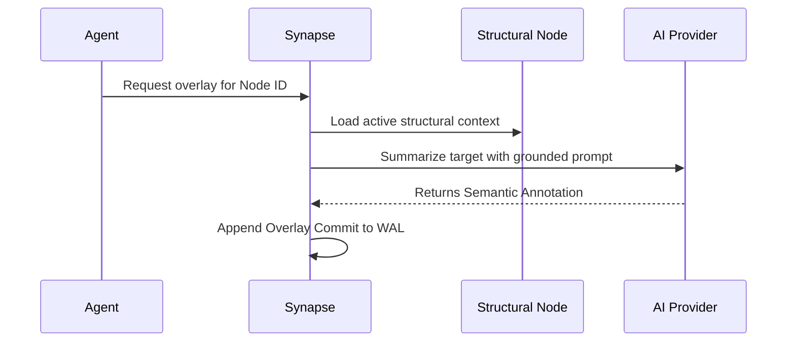

# Semantic Overlays

While Synapse relies on AST parsers to define structural truth, **Semantic Overlays** provide a safe mechanism for AI models to annotate and summarize that structure.

## The Purpose of Overlays

Code structure tells you *how* a system is built. Semantic overlays tell you *why*.
Overlays allow agents to attach:
- High-level module summaries
- Explanations of complex class logic
- Developer-specific intent or warnings
- Dependency rationales

These annotations drastically improve Stage 3 (Semantic Recall) during hybrid retrieval.

## Overlay Lifecycle

## Strict Invalidation

Overlays are tightly coupled to the lifecycle of their target node. 

Because code changes rapidly, static AI summaries become dangerous if allowed to persist. In Synapse, if a target file, module, class, or function is modified or deleted, **the next ingestion cycle automatically invalidates the overlay**. 

Invalidated overlays remain in the SQLite event history for replay and auditing, but they are strictly excluded from active retrieval windows.

## The Safety Boundary

Semantic overlays are read-only metadata. AI-generated overlays can never:
- Create or mutate structural nodes.
- Generate artificial dependencies (imports).
- Alter file identities.
- Override deterministic parser output. 

This strict separation guarantees that Synapse remains an infrastructure-grade system rather than an unpredictable AI black box.
