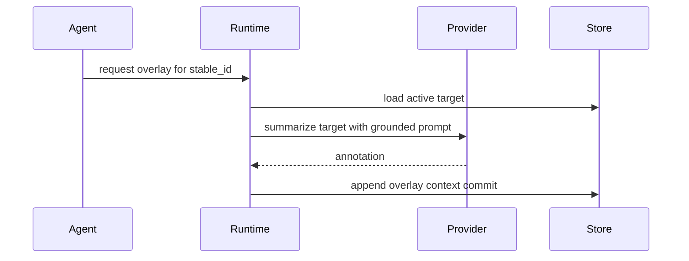

# Semantic Overlays

Semantic overlays are annotations attached to structural nodes.

## Purpose

Overlays let agents and developers add explanations, summaries, and task-specific notes without changing structural truth. They are useful for documenting why a module matters, what a class does, or how a subsystem should be approached.

## Lifecycle

## Invalidation

Overlays inherit the lifecycle of their target. If the target file, module, class, or function changes or disappears, the next ingestion invalidates the overlay. Invalidated overlays remain in history but are excluded from active retrieval.

## Safety

AI-generated overlays are always annotations. They never create structural nodes, edges, imports, or file identities.
