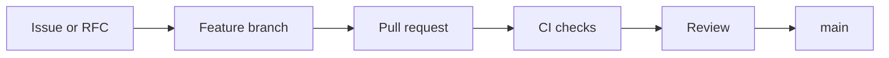

# Git Workflow

## Purpose

The project Git workflow keeps implementation changes reviewable and preserves architectural intent.

## Architecture

## Lifecycle

Open an issue or RFC for behavior changes, create a branch, keep commits focused, update docs/tests, and merge after CI and review.

## Responsibilities

- Use clear branch names.
- Keep generated local state out of Git.
- Add ADRs for major decisions.
- Update changelog for user-visible behavior.

## Data Flow

Design intent flows from issue/RFC to code, docs, tests, and changelog.

## Failure Modes

- Large mixed-purpose PRs hide risk.
- Schema changes land without migration notes.
- Docs drift from implementation.

## Edge Cases

- Security fix requires private coordination.
- Prototype branch intentionally violates standards.
- Revert needed after release.

## Scalability Notes

Adopt labels and maintainership areas as contributors grow.

## Security Notes

Never include secrets, private runtime state, or unredacted sensitive context in commits.

## Performance Considerations

Keep CI fast enough that contributors run the same checks locally.

## Future Extensibility

Add release branches after stable versioning starts.

