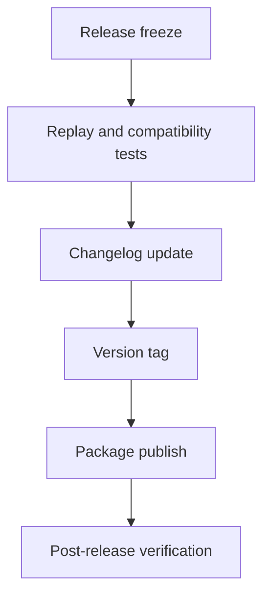

# Release Workflow

## Purpose

The release workflow turns tested runtime changes into versioned OSS releases with clear compatibility expectations.

## Architecture

## Lifecycle

Releases are cut from `main` after CI, replay compatibility tests, docs updates, changelog review, and tag creation.

## Responsibilities

- Maintain semantic versioning after first stable release.
- Document migration notes.
- Verify CLI and import paths.
- Keep source distributions reproducible.
- Record known limitations.

## Data Flow

Merged changes become changelog entries, version metadata, release artifacts, and upgrade notes.

## Failure Modes

- Release breaks existing `.synapse` state.
- Event schemas change without migration.
- Optional extras are not tested.
- Changelog omits behavior changes.

## Edge Cases

- Security release.
- Yanked package.
- Pre-release compatibility warning.
- Storage migration rollback.

## Scalability Notes

Automate artifact creation after manual release checks are stable.

## Security Notes

Use signed tags and protected release credentials before public package publication.

## Performance Considerations

Include replay and startup smoke tests in release validation.

## Future Extensibility

Add automated provenance attestations and SBOM generation.

