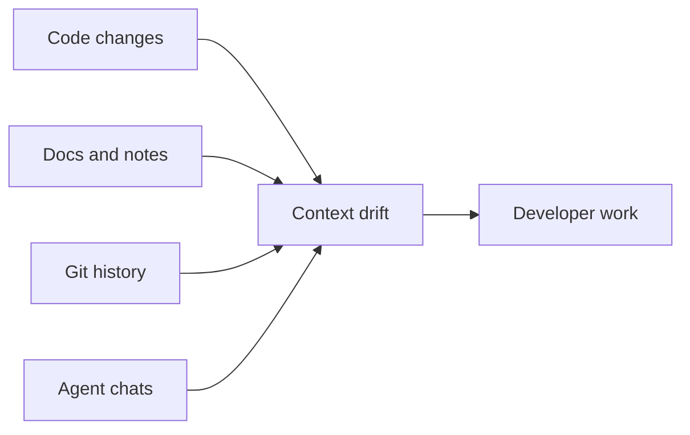

# Problem Statement

## Purpose

AI-assisted software development lacks durable project cognition. Tools can inspect code, retrieve snippets, or remember chats, but they rarely maintain a trustworthy model of how the repository's architecture and intent evolve over time.

## Architecture Of The Problem

## Lifecycle

Context starts useful, becomes stale after refactors and branch changes, then causes incorrect agent recommendations unless a runtime updates and invalidates it.

## Responsibilities

Synapse must identify stable meaning, tie it to Git history, expose it through safe interfaces, and discard or compress noise.

## Data Flow

Repository facts, documentation intent, and human notes become structured cognition objects with validity windows and provenance.

## Failure Modes

- Agents optimize against stale architecture.
- Raw chat memory overwhelms useful context.
- Vectors retrieve plausible but invalid facts.
- Documentation drift remains invisible.

## Edge Cases

- Reverts that invalidate recent assumptions.
- Rebases that rewrite Git lineage.
- Branches with contradictory designs.
- Temporarily experimental code.

## Scalability Notes

The solution must work first for one local developer and one repository. Team and distributed use cases come after the local cognition model is correct.

## Security Notes

Project context can include secrets, unreleased plans, and proprietary architecture. Local-first storage is a product requirement.

## Performance Considerations

Context management must not slow normal development loops.

## Future Extensibility

The problem space naturally expands to team-shared cognition, but only after trust, provenance, and conflict semantics are mature.

