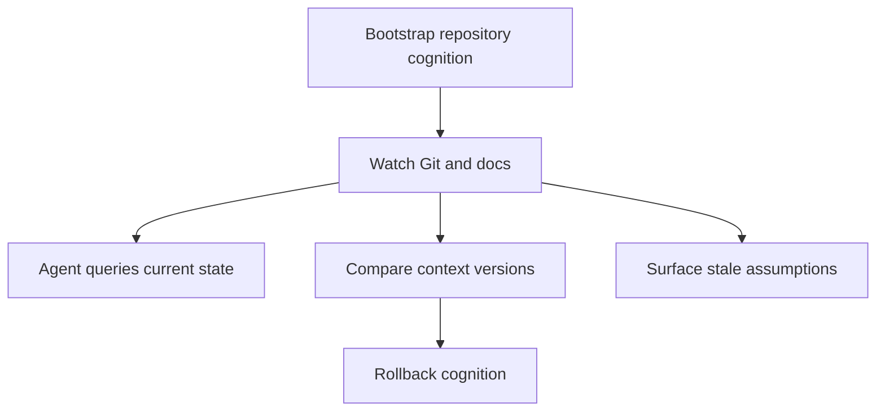

# Use Cases

## Purpose

Use cases define what Synapse should make easy for developers and agents without turning the runtime into a generic automation platform.

## Architecture

## Lifecycle

The user initializes Synapse, reviews initial context, lets the daemon track meaningful changes, and queries or corrects the world model through CLI, dashboard, API, or MCP.

## Responsibilities

- Give agents current architecture summaries.
- Explain why a fact is believed.
- Show what changed cognitively between commits.
- Restore prior cognition after checkout or rollback.
- Detect stale docs and assumptions.

## Data Flow

Human notes and repository changes enter as events; agents consume bounded context resources and scoped tool outputs.

## Failure Modes

- The runtime answers with low-confidence facts without warning.
- The dashboard hides drift.
- Corrections do not propagate to derived indexes.

## Edge Cases

- Multiple AI agents use the same local cognition.
- User explicitly overrides an inferred fact.
- A branch intentionally violates current architecture.

## Scalability Notes

Use cases should remain useful before all advanced memory features exist. The MVP path is init, note, status, diff, rollback, and context query.

## Security Notes

Agent-facing use cases must be permission-gated and redact sensitive context by default.

## Performance Considerations

Interactive queries should use snapshots and indexes but always expose source-of-truth provenance.

## Future Extensibility

Later use cases include team review, documentation maintenance, and IDE integration.

