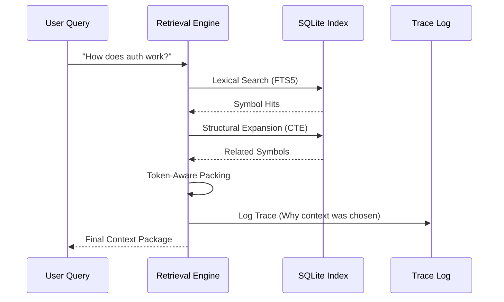

# Retrieval Pipeline

Synap implements a 4-stage retrieval pipeline designed to provide high-signal context while strictly managing the token budget of AI agents.

## Retrieval Order

1.  **Temporal:** We prioritize files and symbols associated with the active branch and recent commits.
2.  **Structural:** We expand the search from initial matches to their neighbors (dependencies, callers, superclasses) using SQL Recursive CTEs.
3.  **Lexical:** We perform exact identifier and keyword matching using SQLite FTS5.
4.  **Semantic:** conceptually related matches (fallback) are retrieved using vector similarity search.

## Token Budgeting

Character counting is imprecise and leads to unpredictable LLM failures. Synap uses **tiktoken** to perform exact token counting.
- **Priority Packing:** We pack context blocks in order of their combined score.
- **Deterministic Truncation:** We stop packing as soon as the budget is reached, ensuring the agent never receives a malformed request.

## Scoring Model

The final context ranking is determined by:
- **Lexical Score:** Quality of identifier match.
- **Structural Distance:** Exponential decay based on distance in the dependency graph.
- **Confidence:** Parser reliability and symbol completeness.

---

## Retrieval Trace Flow

