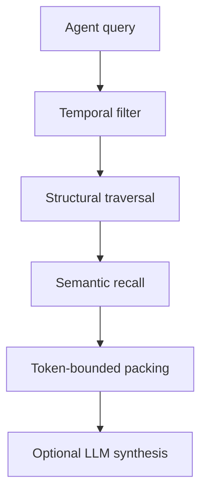

# Retrieval

Hybrid retrieval builds a bounded context window for an agent task.

## Flow

## Stages

1. Temporal filtering reconstructs active nodes, edges, and semantic objects at a context head.
2. Structural traversal finds query-relevant nodes and expands through nearby ownership/import edges.
3. Semantic recall ranks summaries and overlays using keyword and embedding similarity.
4. Context packing enforces token budgets before provider synthesis.

## Bounds

Retrieval caps traversal nodes, semantic candidates, embedding cache size, and output tokens. If no structural match is found, it falls back to a deterministic bounded slice of active context rather than dumping the repository.

## AI Boundary

The LLM receives grounded context and can explain it. It cannot modify structural nodes, create dependencies, or override parser output.
