# Hybrid Retrieval

Retrieval in Synapse is not standard RAG. Instead of relying solely on text chunks and vector embeddings, Synapse builds a **bounded context window** by traversing a deterministic structural graph.

## The Retrieval Flow

```mermaid
flowchart TD
    Req[Agent Query] --> TFilter[1. Temporal Filter]
    TFilter --> STraverse[2. Structural Traversal]
    STraverse --> SRecall[3. Semantic Recall]
    SRecall --> Pack[4. Token-Bounded Packing]
    Pack --> LLM[Optional LLM Synthesis]
    
    classDef step fill:#1e293b,stroke:#3b82f6,stroke-width:2px;
    class TFilter,STraverse,SRecall,Pack step;
```

### Stage 1: Temporal Filtering
Before any search occurs, Synapse reconstructs the repository state at a specific point in time (the "Context Head"). This automatically filters out nodes, edges, and summaries that were invalidated by recent commits, ensuring agents never reason over deleted code.

### Stage 2: Structural Traversal
Synapse matches the query against structural nodes (module names, class names, function signatures). Once an entry point is found, the engine executes a bounded traversal, walking ownership edges (e.g., "What methods are in this class?") and import edges (e.g., "What does this file depend on?").

### Stage 3: Semantic Recall
While structural traversal handles deterministic dependencies, **Semantic Recall** evaluates AI-generated summaries and overlays attached to the graph. It uses keyword matching and local embedding similarity to pull in context that answers the *intent* of the query, even if the exact symbol name wasn't mentioned.

### Stage 4: Token-Bounded Packing
Synapse protects the LLM’s context window. Retrieval enforces strict limits on traversal depth, candidate count, and final output tokens. Context is packed efficiently, providing the highest-signal subgraphs first.

## The AI Boundary
When optional LLM Synthesis is enabled, the provider (e.g., Claude, OpenAI) is given the packed, grounded context and asked to explain it. **The LLM cannot modify structural nodes, invent dependencies, or override parser output.**
