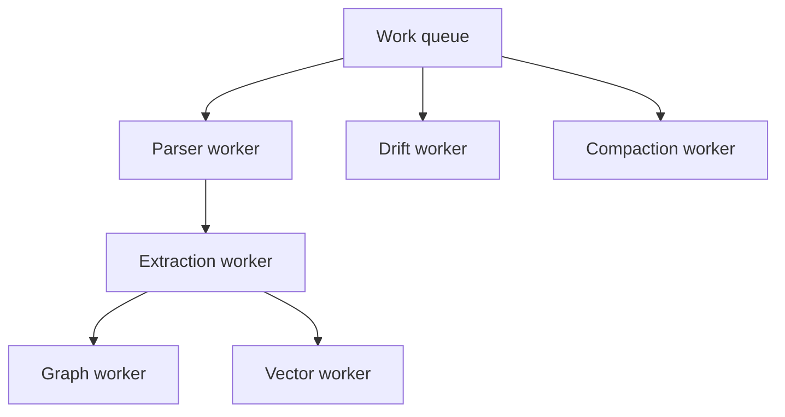

# Background Workers

## Purpose

Background workers perform parsing, semantic extraction, graph updates, vector updates, drift scans, and compaction without blocking the developer workflow.

## Architecture

## Lifecycle

Workers start with the daemon, claim jobs, checkpoint progress, emit results, and shut down cancel-safely.

## Responsibilities

- Process jobs idempotently.
- Respect runtime mode and resource budgets.
- Report progress and failures.
- Avoid blocking interface reads.
- Use scoped locks for shared resources.

## Data Flow

Workers consume job descriptors and produce durable events, context objects, projection updates, or diagnostics.

## Failure Modes

- Worker dies after object write but before DB commit.
- CPU-heavy parser starves API tasks.
- Embedding worker floods semantic retrieval indexes.
- Compaction races with rollback.

## Edge Cases

- User pauses indexing.
- Qdrant is unavailable.
- Tree-sitter grammar is missing.
- Repository files change during parse.

## Scalability Notes

Worker pools should be configurable by CPU and memory budget. The default must be conservative for laptops.

## Security Notes

Workers must not execute repository code. Parsing is data processing, not evaluation.

## Performance Considerations

Use executor pools for CPU-bound parsing and debounce repeated jobs for the same file.

## Future Extensibility

Add specialized workers for language-specific extractors and external graph backends.
