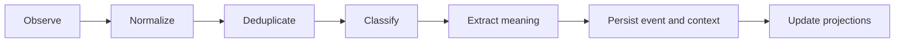

# Event Pipeline

## Purpose

The event pipeline converts observed repository activity into durable cognition changes through an idempotent, replayable flow.

## Architecture

## Lifecycle

Events enter as cheap observations, receive stable IDs and source metadata, pass relevance filters, then produce durable event records and context objects.

## Responsibilities

- Normalize filesystem, Git, note, and API events.
- Deduplicate repeated watcher noise.
- Apply relevance filters.
- Preserve causal ordering where required.
- Commit durable outputs atomically.

## Implemented Contract

The first pipeline is an in-process bounded `asyncio.PriorityQueue`. Work items carry a kind, payload, correlation ID, attempt count, and retry limit. Workers isolate failures, retry with lower priority, expose queue health, and drain before daemon shutdown.

Durable cognition writes now pass through the `CognitiveTransactionEngine`. A context update writes a transaction journal row, stores the event payload object, appends the event, creates the context object with the assigned event sequence, stores the context object, indexes the context, activates the branch head, and commits the transaction journal. Interrupted transactions are marked failed during startup recovery rather than being silently trusted.

## Data Flow

`ObservedEvent` becomes `EventRecord`; relevant records become semantic deltas; deltas become context versions and memory projections.

## Failure Modes

- Event order changes semantic outcome.
- Duplicate events create duplicate facts.
- Pipeline stores parsed output before event record.
- Poisoned event retries forever.
- Object store and SQLite diverge without a transaction journal.

## Edge Cases

- Commit and file change arrive together.
- Watcher misses an event while daemon is stopped.
- Manual note references uncommitted code.
- Git checkout invalidates queued work.

## Scalability Notes

Prioritize events by user visibility and cognitive importance. Batch low-priority enrichment work.

## Security Notes

Normalize source trust before extraction. Untrusted events cannot bypass trust gates by entering through a different interface.

## Performance Considerations

Use bounded queues and coalescing. Keep synchronous event capture tiny.

## Future Extensibility

The in-memory queue can be replaced by a durable work queue if the event state machine remains stable.
