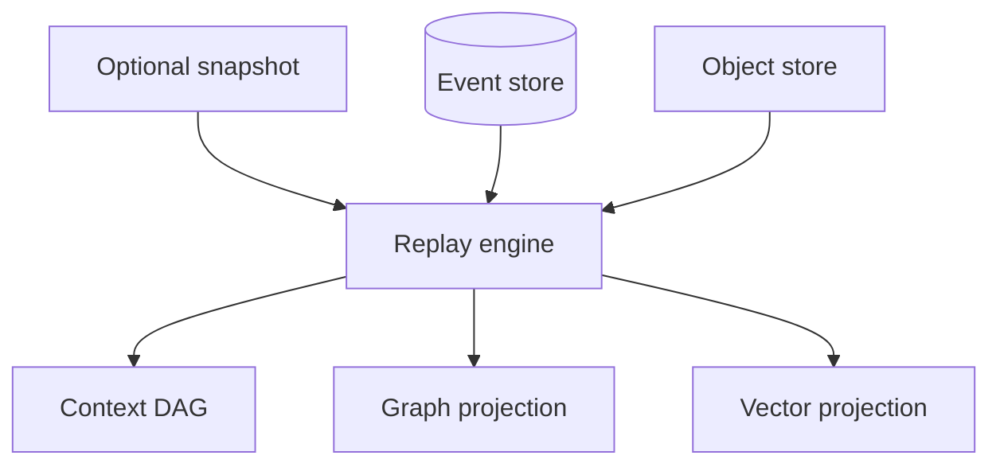

# Replay Engine

## Purpose

The replay engine reconstructs cognition state from append-only events and immutable objects. It is the proof that Synapse state is not an opaque cache.

## Architecture

## Lifecycle

Replay starts from genesis or a trusted snapshot, applies events in deterministic order, verifies object hashes, and rebuilds derived projections.

## Responsibilities

- Rebuild active context state.
- Verify event and object integrity.
- Support rollback validation.
- Detect projection corruption.
- Provide deterministic test fixtures.

## Implemented Contract

The replay correctness engine lives in `src/synapse/replay/`. It streams persisted events in `sequence` order, verifies event payload objects, verifies context objects through the content-addressed object store, reconstructs context lineage, validates active heads, emits replay trace events, and computes a deterministic state hash from event identity, lineage, active heads, and checkpoint position.

`src/synapse/runtime/replay.py` remains as a compatibility export. Snapshot-assisted replay is checkpoint-aware today and still treats snapshots only as acceleration metadata.

## Data Flow

Replay reads events and objects, recreates DAG nodes, then projects graph and vector state for a selected context head.

## Failure Modes

- Non-deterministic ordering produces different hashes.
- Snapshot trusted without hash verification.
- Missing object prevents full reconstruction.
- Migration changes replay semantics.
- Active head references a context that no longer exists.
- Context edge references a missing parent.

## Edge Cases

- Event references a pruned derived index.
- Rebase changed Git references but event history remains.
- User requests replay to a historical branch head.
- Context object schema evolved.

## Scalability Notes

Use snapshots as acceleration only. Long-term scalability requires stable migrations and chunked replay.

## Security Notes

Replay must validate tamper-evident hashes and refuse corrupted source-of-truth state.

## Performance Considerations

Replay should stream data and avoid loading the entire object graph when reconstructing a narrow context.

## Future Extensibility

Add partial replay by path, subsystem, or branch after global replay is correct.
