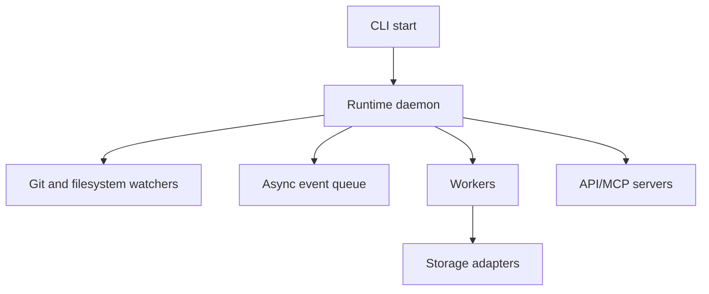

# Runtime Daemon

## Purpose

The runtime daemon is the local long-running process that watches repository state, coordinates background workers, and serves current cognition to interfaces.

## Architecture

## Lifecycle

The daemon initializes settings, validates repository state, opens storage, starts watchers and workers, serves interfaces, and drains jobs on shutdown.

## Responsibilities

- Own process lifecycle and runtime mode.
- Enforce queue backpressure.
- Coordinate startup recovery.
- Expose health and status.
- Keep interface servers independent from pipeline internals.

## Implemented Contract

`synapse start` initializes storage, verifies replay state, bootstraps context if no active head exists, starts bounded workers, and polls Git state cheaply. Meaningful Git changes enqueue repository indexing work; heavy parsing and extraction stay outside Git hot paths.

## Data Flow

Watchers and commands enqueue events. Workers process them into durable records and update active context projections.

## Failure Modes

- Daemon starts against wrong repository root.
- Worker crash leaves claimed event unfinished.
- Shutdown interrupts object write.
- API serves stale status without warning.

## Edge Cases

- No Git repository exists yet.
- Repository is temporarily locked.
- Multiple daemon instances start for one repo.
- User switches branches during startup.

## Scalability Notes

One daemon owns one repository for the MVP. Multi-repository operation should use explicit process isolation.

## Security Notes

The daemon should bind local interfaces to loopback by default and require explicit opt-in for broader exposure.

## Performance Considerations

Startup should prefer latest valid snapshot and then replay tail events. Heavy indexing should begin after the daemon is ready.

## Future Extensibility

Add a repository supervisor process only after single-repository daemon semantics are proven.
