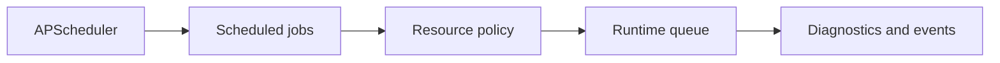

# Task Scheduling

## Purpose

Scheduling handles periodic maintenance such as drift scans, compaction, snapshots, health checks, and low-priority enrichment.

## Architecture

## Lifecycle

Jobs are registered at daemon startup, gated by runtime mode, enqueued with priority, and skipped or deferred when resources are constrained.

## Responsibilities

- Schedule snapshots and compaction.
- Run targeted and broad drift scans.
- Emit health diagnostics.
- Defer expensive enrichment during low-power mode.
- Prevent overlapping maintenance jobs.

## Data Flow

The scheduler emits work events. Workers perform actual state changes so scheduled jobs use the same pipeline as user-triggered work.

## Failure Modes

- Maintenance job overlaps with itself.
- Clock changes trigger job bursts.
- Scheduled work bypasses queue backpressure.
- Compaction runs during active branch switch.

## Edge Cases

- Laptop sleeps mid-job.
- User changes runtime mode.
- Repository is idle for days.
- Project has no snapshots yet.

## Scalability Notes

Use jitter and backoff. Large repositories should schedule broad scans less frequently.

## Security Notes

Scheduled jobs must obey the same permissions and trust policies as interactive commands.

## Performance Considerations

Schedule expensive work during idle windows and expose current maintenance activity to `status`.

## Future Extensibility

Add user-configurable schedules in a local config file after defaults stabilize.

