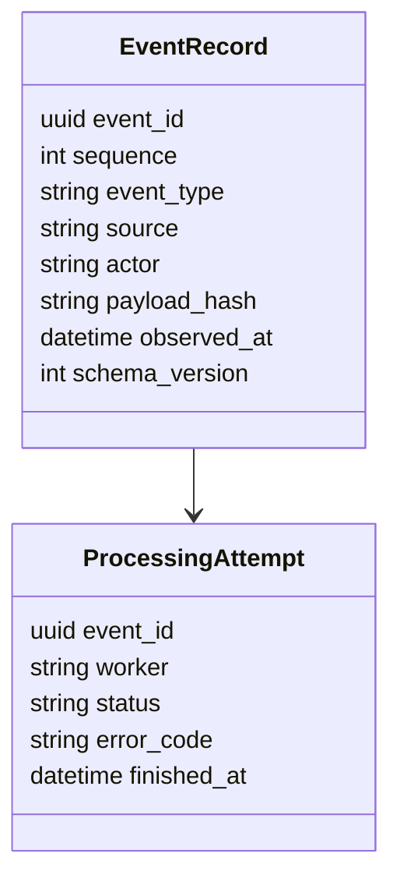

# Event Schemas

## Purpose

Event schemas define the durable event vocabulary that powers replay, audit, rollback, and diagnostics.

## Architecture

## Lifecycle

Events are observed, normalized, validated, appended, processed, and optionally superseded by later events.

## Responsibilities

- Keep event names stable.
- Store large payloads by hash.
- Support deterministic ordering.
- Track processing attempts and failures.
- Version payload schemas.

## Data Flow

Observed Git, file, note, API, scheduler, and projection events become append-only records.

## Failure Modes

- Event payload is mutable.
- Event type changes without migration.
- Ordering relies on wall-clock timestamps.
- Diagnostics are replayed as durable domain events.

## Edge Cases

- Duplicate event ID.
- Event with no semantic delta.
- Replayed event from older schema.
- Failed event later succeeds.

## Scalability Notes

Use compact event rows and object-store payloads.

## Security Notes

Events can expose paths, branch names, and evidence references; redact when serving externally.

## Performance Considerations

Batch append where safe and index sequence, type, context hash, and source path.

## Future Extensibility

Add generated JSON Schema or msgpack schema definitions for client compatibility.

