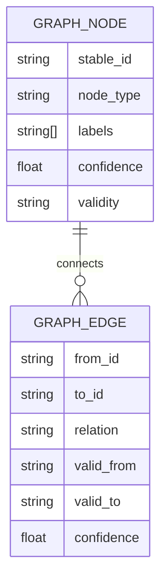

# Graph Schema

## Purpose

The graph schema defines the structural world model Synapse projects from cognition objects.

## Architecture

## Lifecycle

Graph nodes and edges are projected from context deltas, activated by context head, and rebuilt during replay or rollback.

## Responsibilities

- Model modules, services, packages, docs, decisions, risks, assumptions, and incidents.
- Model relations such as depends_on, documents, supersedes, contradicts, owns, implements, and impacts.
- Store temporal validity and provenance references.

## Data Flow

Semantic objects emit graph deltas. The graph adapter applies deltas to the active projection.

## Failure Modes

- Relation vocabulary grows without governance.
- Edges lack validity windows.
- Node identity changes across refactors.
- Graph projection diverges from object store.

## Edge Cases

- Many files implement one service.
- One decision affects multiple modules.
- Relation is branch-specific.
- A relation is inferred rather than explicit.

## Scalability Notes

Keep relation types curated and index common traversals.

## Security Notes

Graph queries can reveal sensitive architecture and require permission filters.

## Performance Considerations

Apply deltas incrementally and cache summaries by context head.

## Future Extensibility

Map this schema to Neo4j labels and relationships when the backend migrates.

