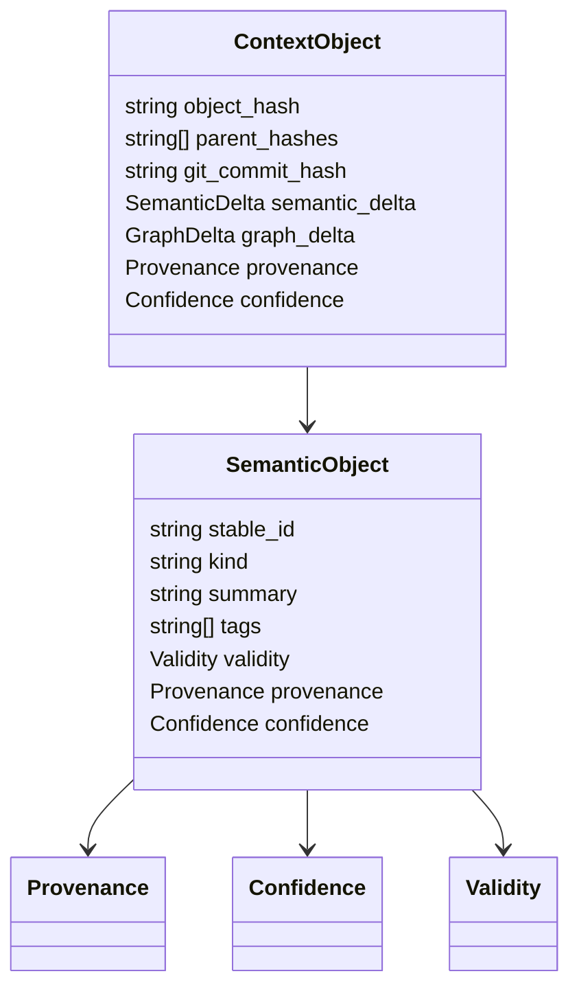

# Semantic Object Schemas

## Purpose

Semantic object schemas define the durable units of cognition that Synapse stores, links, retrieves, expires, and replays.

## Architecture

## Lifecycle

Semantic objects are created from extracted evidence, stored immutably, indexed into graph/vector projections, and expired or superseded through later context objects.

## Responsibilities

- Represent decisions, constraints, assumptions, risks, modules, incidents, and roadmap facts.
- Carry stable IDs and source evidence.
- Record validity windows and branch scope.
- Support semantic search and graph linking.

## Data Flow

Extractor output becomes candidate semantic objects. Relevance, confidence, and trust gates decide whether they are persisted.

## Failure Modes

- Stable IDs change after renames.
- Summary loses evidence details.
- Objects omit validity metadata.
- Agent-generated content uses trusted source type.

## Edge Cases

- One object has multiple evidence sources.
- One evidence span creates several facts.
- Fact applies only to a branch.
- Fact is useful but low confidence.

## Scalability Notes

Keep semantic objects compact and store long evidence separately.

## Security Notes

Object payloads may contain proprietary architecture. Apply local permissions and redaction before exposure.

## Performance Considerations

Use msgpack canonical serialization and avoid embedding raw source text unless retained as explicit evidence.

## Future Extensibility

Add schema registry and migration helpers after object families stabilize.

