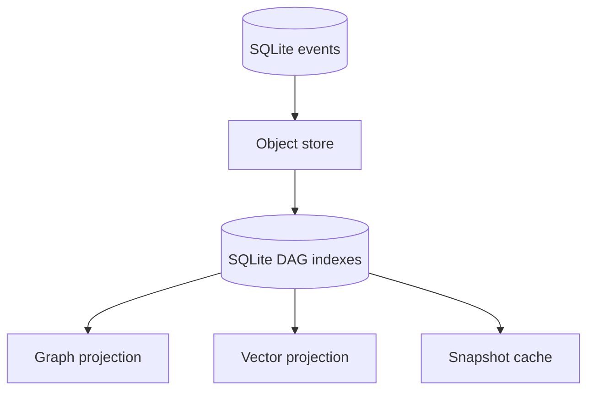

# Storage Schema

## Purpose

The storage schema specifies how durable truth, derived indexes, and caches relate.

## Architecture

## Lifecycle

Truth is written to SQLite and object store. Projections and snapshots are rebuilt from truth whenever integrity checks fail.

## Responsibilities

- Separate source-of-truth data from derived data.
- Keep object hashes stable.
- Record schema versions.
- Support migrations and integrity checks.

## Data Flow

Events reference payload objects; context objects reference deltas; projections reference context heads.

## Failure Modes

- Derived index becomes canonical.
- Snapshot outlives schema version.
- Object store and SQLite transaction diverge.
- Migration cannot replay old events.

## Edge Cases

- Disk cleanup removes cache but not truth.
- User moves repository path.
- Multiple Synapse versions touch same state.
- Optional Qdrant backend absent.

## Scalability Notes

Use bounded snapshots, object fanout, and compact SQLite rows.

## Security Notes

All local stores inherit repository sensitivity. Avoid committing `.synapse/`.

## Performance Considerations

Optimize reads by context head and branch. Optimize writes by batching related metadata changes.

## Future Extensibility

Add remote object sync and graph backend migrations behind explicit adapters.

