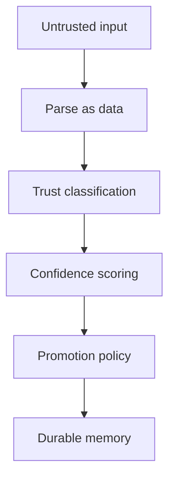

# Context Poisoning

## Purpose

Context poisoning occurs when malicious, mistaken, or low-trust content is promoted into durable cognition and later misleads agents.

## Architecture

## Lifecycle

All external and repository content enters as untrusted or source-scoped data. Promotion requires provenance, relevance, confidence, and policy checks.

## Responsibilities

- Treat Markdown instructions as content, not commands.
- Keep agent output low-trust by default.
- Require evidence for durable facts.
- Support manual correction and invalidation.
- Audit memory promotions.

## Data Flow

Candidate facts pass through trust and confidence gates before becoming active context.

## Failure Modes

- Malicious doc tells agent to ignore policies.
- Hallucinated agent note becomes verified architecture.
- Poisoned context spreads through summaries.
- Low-trust source boosts confidence via repetition.

## Edge Cases

- Untrusted content contains true facts.
- Human imports external design notes.
- Generated docs look authoritative.
- A compromised branch contains malicious instructions.

## Scalability Notes

Trust checks must be cheap and centralized. Do not scatter promotion logic across extractors.

## Security Notes

Keep raw evidence available for review but do not expose it broadly through MCP.

## Performance Considerations

Use deterministic trust rules before expensive semantic validation.

## Future Extensibility

Add source allowlists, signed notes, and policy packs for teams.

