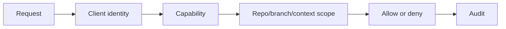

# Permission System

## Purpose

The permission system controls who or what may read, write, rollback, repair, or administer cognition state.

## Architecture

## Lifecycle

Permissions are loaded at startup, evaluated per request, audited for sensitive actions, and reloaded when policy changes.

## Responsibilities

- Define read, note, write, rollback, repair, and admin capabilities.
- Scope access by repository, branch, and context.
- Default MCP clients to read-only.
- Require explicit approval for destructive-feeling operations.
- Audit denials and mutations.

## Data Flow

Interface requests become authorization checks before runtime commands execute.

## Failure Modes

- Permissions checked only in CLI but not MCP.
- Long-running job continues after permission revocation.
- Branch scope ignored.
- Denied action lacks diagnostic reason.

## Edge Cases

- Local single-user mode.
- Multiple agents with different trust.
- Permission reload during request.
- Emergency repair command.

## Scalability Notes

Start with local policy files. Avoid building a distributed auth system before team mode exists.

## Security Notes

Authorization must be code-enforced. Prompt instructions are not security controls.

## Performance Considerations

Cache parsed policies but re-check capabilities at execution time.

## Future Extensibility

Add signed client identities and role-based policies for shared environments.

