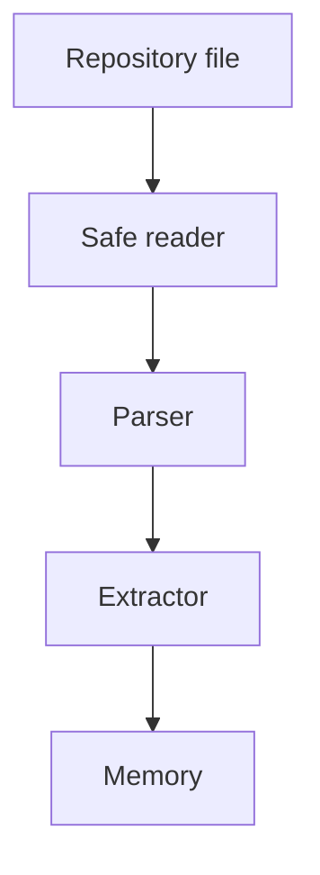

# Sandboxing

## Purpose

Sandboxing ensures Synapse parses and indexes repository content without executing arbitrary project code.

## Architecture

## Lifecycle

Files are read as bytes or text, parsed by safe libraries, and never executed during indexing. Optional external tools must run behind explicit permissions.

## Responsibilities

- Avoid importing repository modules for analysis.
- Avoid shelling out to project scripts in default mode.
- Limit file size and parse time.
- Handle malformed files safely.
- Isolate optional tool execution.

## Data Flow

Content flows through readers, parsers, and extractors as inert data.

## Failure Modes

- Parser invokes language runtime.
- Tool integration executes repository code.
- Huge file causes memory pressure.
- Symlink escapes expected repository root.

## Edge Cases

- Binary files.
- Symlinked docs.
- Generated code.
- Git submodules.

## Scalability Notes

Use file size limits, parse budgets, and skip lists.

## Security Notes

Sandboxing is a default behavior, not a configuration suggestion.

## Performance Considerations

Short-circuit binary and oversized files before parser allocation.

## Future Extensibility

Add optional OS-level sandbox runners for approved external analysis tools.

