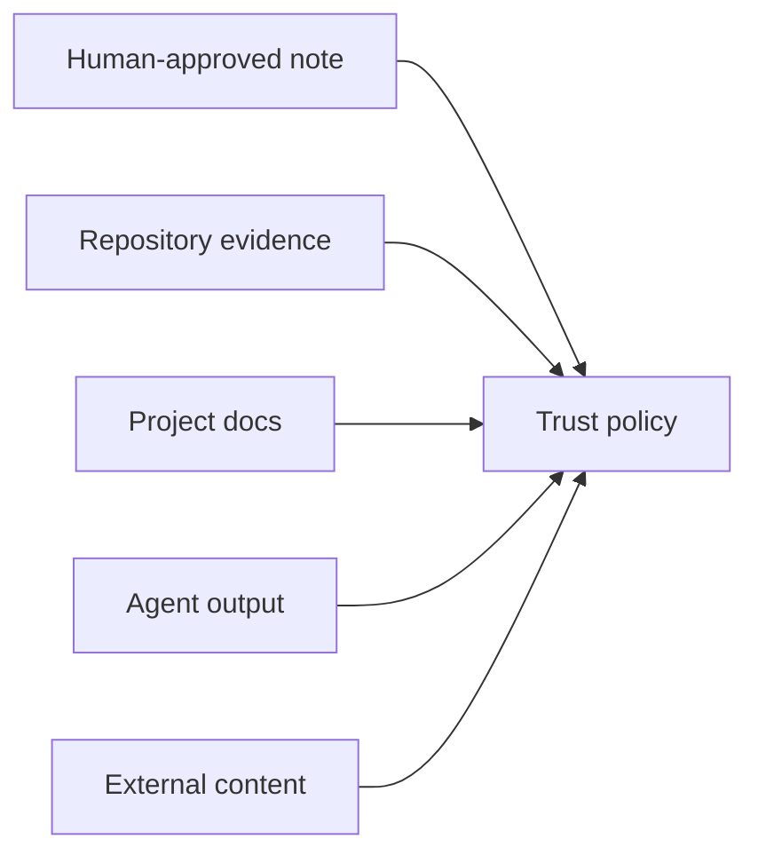

# Trust Model

## Purpose

The trust model ranks cognition sources so Synapse can decide what to believe, what to expose, and what requires review.

## Architecture

## Lifecycle

Sources receive initial trust levels, which can change through verification, correction, drift, or policy updates.

## Responsibilities

- Classify source type and actor.
- Store trust level and verification status.
- Combine trust with confidence.
- Prevent low-trust promotion.
- Explain trust decisions.

## Data Flow

Trust records attach to provenance and are evaluated before persistence, query, and mutation.

## Failure Modes

- Trust and confidence are conflated.
- Agent content inherits user's trust automatically.
- Repeated low-trust claims appear strong.
- Trust policy changes do not re-evaluate active facts.

## Edge Cases

- Human note later proven wrong.
- Code source is generated from low-trust input.
- External ADR imported into repo.
- Conflicting trusted sources.

## Scalability Notes

Keep trust rules simple and local first. Team policy engines come later.

## Security Notes

Trust is enforcement data. Protect it from unauthorized mutation.

## Performance Considerations

Store trust levels in indexed metadata so queries can filter cheaply.

## Future Extensibility

Add signed provenance, maintainer approvals, and repository policy files.

