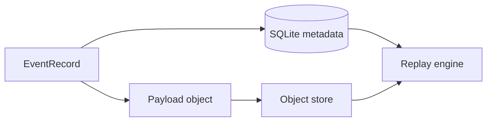

# Event Store

## Purpose

The event store is the append-only durable log of observed and processed cognition events. It provides traceability, replay, and auditability.

## Architecture

## Lifecycle

Events are appended once, never edited, and may be superseded by later events. Compaction creates summaries but does not rewrite history.

## Responsibilities

- Record source, actor, type, payload hash, and timestamp.
- Preserve processing attempts and outcomes.
- Support deterministic ordering.
- Feed replay and audit.
- Track schema versions.

## Data Flow

Observed events become stored event records. Relevant events produce context object creation events and projection update metadata.

## Failure Modes

- Mutable event payloads.
- Missing payload object.
- Event timestamp used as only ordering key.
- Compaction deletes necessary replay data.

## Edge Cases

- Duplicate event from watcher.
- Event with no durable cognition delta.
- Replayed event under newer schema.
- User correction supersedes previous fact.

## Scalability Notes

Use monotonically increasing sequence IDs plus event IDs. Archive old payloads only after snapshot and replay verification.

## Security Notes

Events may include sensitive source references. Access to event history should be permission-scoped.

## Performance Considerations

Batch appends when possible but preserve logical order. Keep payloads out of hot SQLite rows.

## Future Extensibility

Add event signing and export/import for trusted team synchronization.

