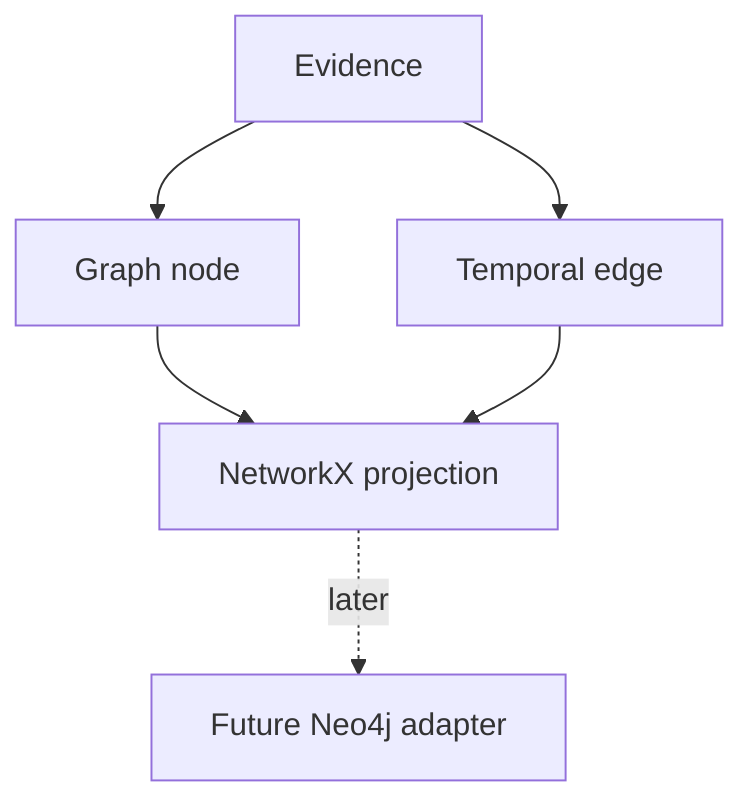

# Graph Projection

## Purpose

Graph projection stores the derived structural world model: modules, services, decisions, assumptions, risks, dependencies, incidents, and temporal relationships.

## Architecture

## Lifecycle

Graph deltas are produced by extraction, applied to the active projection, and replayed from context objects after rollback or repair.

## Responsibilities

- Represent entities and relationships.
- Track valid intervals on edges.
- Preserve stable IDs across renames.
- Support impact queries.
- Feed context summaries.

## Implemented Contract

The first implementation stores graph nodes and edges in SQLite as source-indexed projection metadata, then exposes a `NetworkXGraphProjection` adapter that rebuilds an in-process `MultiDiGraph` for a context hash. This keeps NetworkX a derived view; replay still depends on events, context objects, and object-store integrity.

## Data Flow

Semantic extraction emits graph deltas; the graph adapter applies them to a branch/context-specific projection.

## Failure Modes

- Static graph ignores time.
- Rename creates duplicate entities.
- Derived projection diverges from object store.
- Graph queries return low-trust facts without labels.

## Edge Cases

- One file contains multiple modules.
- One decision affects many packages.
- Dependency is optional or environment-specific.
- Architecture relation changes direction after refactor.

## Scalability Notes

NetworkX is sufficient for MVP iteration. Neo4j becomes relevant when graph size or query complexity exceeds in-process limits.

## Security Notes

Graph traversals may reveal sensitive architecture. Apply query-level permission filters.

## Performance Considerations

Apply deltas incrementally and cache common impact queries by context head.

## Future Extensibility

Maintain a graph adapter interface so Neo4j can become a backend without changing cognition semantics.
