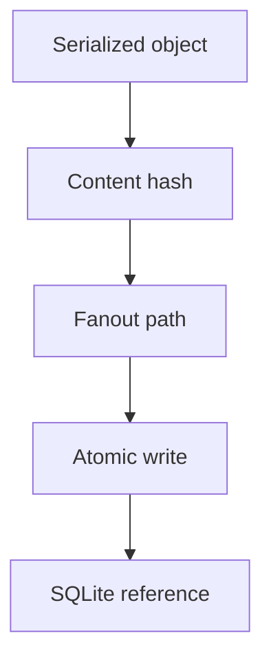

# Object Store

## Purpose

The content-addressed object store holds immutable cognition objects, semantic deltas, graph deltas, evidence bundles, and compacted snapshots.

## Architecture



## Lifecycle

Objects are serialized canonically, hashed, written atomically, referenced from SQLite, and never modified in place.

## Responsibilities

- Provide Git-like object identity.
- Deduplicate identical content.
- Store large payloads outside SQLite.
- Support integrity verification.
- Enable replay and repair.

## Implemented Contract

The initial implementation writes canonical msgpack envelopes compressed with zlib. The object hash is the SHA-256 digest of the uncompressed canonical envelope:

```text
{ kind, schema_version, payload }
```

Objects are stored with two-character fanout under `.synapse/objects/<hh>/<rest>`. Writes use a temporary file, flush, fsync, and atomic rename. Existing objects are verified before being accepted as deduplicated content.

## Data Flow

The version engine writes objects first, then records references in SQLite within the same logical transaction boundary.

## Failure Modes

- Object written but not indexed.
- Index references missing object.
- Non-canonical serialization changes hashes.
- Partial file write after crash.
- Corrupted compressed bytes fail verification before replay trusts them.

## Edge Cases

- Hash collision handling.
- Disk full during atomic rename.
- Object schema migration.
- User manually deletes object files.

## Scalability Notes

Use hash fanout directories and optional compression for cold objects. Track reference counts for safe garbage collection.

## Security Notes

Object paths should not leak source content. Sensitive evidence objects inherit source access policies.

## Performance Considerations

Use msgpack for compact binary serialization and avoid rewriting existing objects.

## Future Extensibility

Support signed objects and remote object synchronization after local trust semantics exist.
