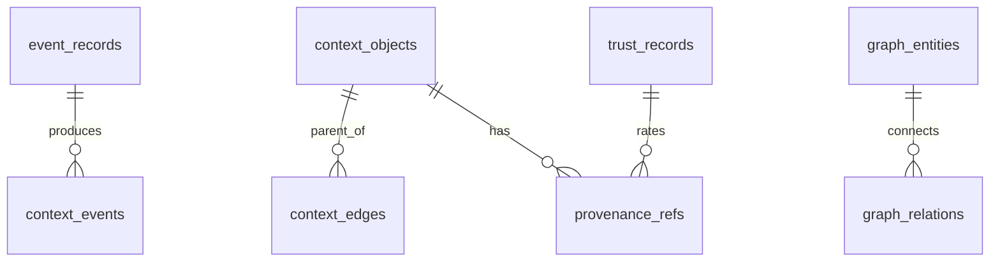

# SQLite Schema

## Purpose

SQLite in WAL mode stores durable metadata, event records, DAG indexes, provenance references, trust records, and projection metadata for local-first operation.

## Architecture

## Lifecycle

The database is created during `synapse init`, migrated on startup, written transactionally by workers, and verified by `synapse doctor`.

## Responsibilities

- Store append-only events.
- Index context DAG lineage.
- Track active heads by repository and branch.
- Store compact graph metadata.
- Track migration versions.

## Initial Tables

- `event_records`: event ID, type, source, actor, payload hash, observed time.
- `context_objects`: object hash, Git commit, schema version, created time.
- `context_edges`: child hash, parent hash, edge type.
- `provenance_refs`: fact ID, source URI, source hash, span, trust ID.
- `trust_records`: source, trust level, verification status.
- `projection_state`: projection name, context head, state hash.

## Implemented Tables

The current schema uses these table names:

- `object_refs`
- `events`
- `context_objects`
- `context_edges`
- `active_heads`
- `semantic_objects`
- `graph_nodes`
- `graph_edges`
- `trust_records`
- `snapshots`
- `projection_state`
- `schema_migrations`
- `cognition_transactions`
- `transaction_objects`

`events.sequence` is the deterministic replay order. Large event payloads are content-addressed objects and referenced by `payload_hash`.

`cognition_transactions` journals atomic cognition updates that span object-store writes and SQLite rows. `transaction_objects` links a transaction to every object hash it created or referenced, allowing recovery to distinguish committed cognition from interrupted writes.

## Data Flow

Large payloads live in the object store; SQLite stores indexes, references, and transaction boundaries.

## Failure Modes

- WAL files left after crash.
- Migration partially applied.
- Payload stored inline grows database too quickly.
- Foreign key constraints disabled.
- Transaction journal marks a write committed before its context object is durable.
- Interrupted transactions remain `in_progress` after restart.

## Edge Cases

- Rebase leaves Git commit references unreachable.
- Event payload object is missing.
- Multiple repositories accidentally share one database.
- Schema version downgrade.

## Scalability Notes

Use indexes for event time, event type, context hash, Git commit, branch, source path, and trust level. Vacuum and checkpoint WAL during maintenance.

## Security Notes

SQLite files should inherit local filesystem permissions. Do not store secrets unredacted in diagnostic tables.

## Performance Considerations

Use WAL mode, batched writes, prepared statements through adapters, and small transactions around atomic state changes.

## Future Extensibility

PostgreSQL is not part of the MVP but the schema should avoid SQLite-only modeling where a future migration would be painful.
