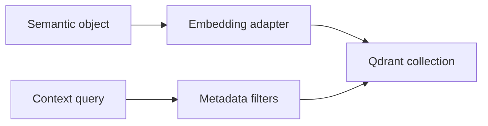

# Semantic Retrieval Index

## Purpose

The semantic retrieval index provides similarity search over durable cognition summaries. It is a derived index, not the source of truth.

## Architecture

## Lifecycle

High-value semantic objects are embedded after persistence, written with context hash and provenance metadata, invalidated when inactive, and rebuilt from objects if needed.

## Responsibilities

- Store retrieval embeddings for stable semantic units.
- Filter by repository, branch, context head, trust, and validity.
- Deprioritize expired facts.
- Avoid embedding raw noise.
- Support local embedding models first.

## Data Flow

Context objects produce semantic summaries; embedding workers write vector payloads that reference source object hashes.

## Failure Modes

- Retrieval returns expired facts.
- Embedding model change mixes incompatible vectors.
- Vector payload loses provenance.
- Retrieval index becomes truth by accident.

## Edge Cases

- Fact is active on one branch and expired on another.
- User changes embedding model.
- Qdrant is not running.
- Low-confidence fact is useful but must be labeled.

## Scalability Notes

Partition collections by embedding model and schema version. Use metadata filters aggressively.

## Security Notes

Embeddings can leak semantic content. Treat vector stores as sensitive local state.

## Performance Considerations

Batch embeddings and skip low-value chunks. Keep query result sets small and rerank with provenance-aware scoring.

## Future Extensibility

Add cloud embedding providers through adapters without coupling core memory to a vendor.
