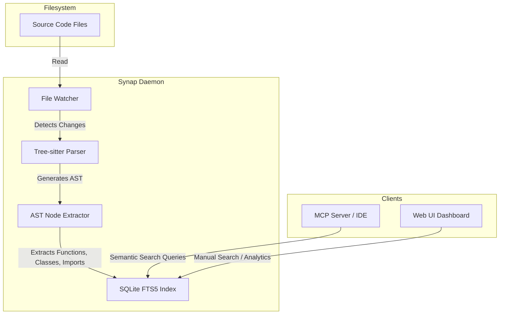

Synap is designed to be a completely local, highly performant semantic indexing engine. Instead of relying on expensive vector databases or sending your proprietary code to third-party APIs, Synap runs on your machine and uses battle-tested native tools.

## Architecture Diagram

The following diagram illustrates how Synap processes your codebase, from raw source files to a queryable SQLite index.

## Design Choices

We made several intentional design decisions to ensure Synap is fast, private, and highly accurate for AI coding agents.

### 1. Tree-sitter over Regular Expressions
Regular expressions are fragile when parsing complex nested structures like code. Synap uses **Tree-sitter**, the same parsing library used by NeoVim and GitHub, to generate highly accurate Abstract Syntax Trees (ASTs). This allows Synap to understand the difference between a function definition, a class definition, and a variable assignment, regardless of formatting.

### 2. SQLite FTS5 over Vector Databases
While vector databases (like Pinecone or Milvus) are great for fuzzy conceptual search, they often fail at exact syntactic matches (e.g., finding the exact definition of `AuthManager`). By using **SQLite's FTS5 (Full-Text Search)** extension, Synap provides sub-millisecond retrieval of exact code symbols without the massive overhead of generating and storing vector embeddings.

SQLite runs locally in a single file (`.synap/index.db`), meaning there are no docker containers to manage, and zero latency.

### 3. Local-First and Privacy-Focused
Your codebase is your most valuable asset. Synap is built to run entirely on `localhost`. The daemon watches your files and indexes them locally. When your IDE or AI agent (via the MCP protocol) queries the index, the query never leaves your machine.

### 4. Python Backend
The indexing daemon is written in Python. This choice was made because Python has excellent bindings for Tree-sitter and SQLite, and allows for rapid iteration of parsing logic. Additionally, the Python ecosystem provides robust tools for eventual AI-driven enhancements (like local LLM integrations) should you choose to enable them.
